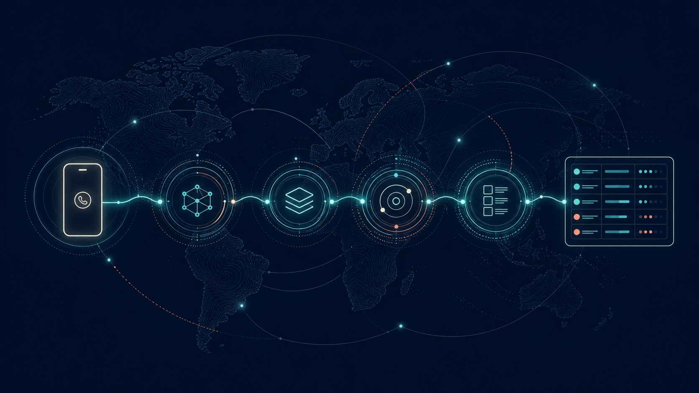

# CallerSignal



**Evidence-backed international phone-number intelligence for agents, CLIs, MCP clients, and the web.**

CallerSignal is an agent-first open-source project for answering “what can we responsibly say about this displayed phone number?” It normalizes a number with explicit country context, checks lawful country-specific evidence, and returns sources, gaps, confidence, and residual uncertainty instead of guessing a caller's identity.

> **Current maturity:** the unreleased `main` branch implements the read-only NL, GB, and US lookup wedge across CLI, MCP, HTTP, and web surfaces. It uses pinned public-safe numbering fixtures and does not identify a caller, query live subscriber data, accept public reports, or yet have an owned persistent Vercel production URL. The `v0.1.0` tag remains the earlier repository-foundation release.

## Try the read-only lookup

A national-format input is never interpreted without an origin region. International input is normalized directly. Every interface renders the same versioned lookup result.

CLI example using a NANPA-reserved fictional number:

```console
PYTHONPATH=src uv run python -m callersignal.cli lookup "202-555-0147" --region US --json
```

The MCP server exposes the same result through `lookup_phone_number`:

```console
PYTHONPATH=src uv run python -m callersignal.mcp_server
```

```json
{
  "name": "lookup_phone_number",
  "arguments": {
    "number": "202-555-0147",
    "origin_region": "US"
  }
}
```

For a local same-origin website and API:

```console
PYTHONPATH=src uv run python tests/e2e/site_server.py
```

Then open `http://127.0.0.1:8765/`. The response contract preserves the raw input and interpretation context, provides canonical E.164 and national display forms, lists every source checked, and distinguishes evidence from gaps and assessments. It also states that caller ID can be spoofed: a displayed number is not proof of the caller, subscriber, provider, safety, or reachability. See the [CLI](docs/cli.md), [MCP](docs/mcp.md), [HTTP](docs/http-api.md), and [web](docs/web.md) guides.

## Why this repository exists

Existing “who called me?” experiences often lead with opaque labels, region assumptions, popularity, or unsupported identity claims. CallerSignal takes a narrower and more inspectable route:

- machine-readable contracts are canonical;
- country interpretation is explicit and reproducible;
- technical facts, source observations, lookup demand, reports, and assessments remain separate;
- every conclusion carries provenance, freshness, reason codes, confidence, gaps, and residual risk;
- unknown stays unknown when evidence cannot support a stronger answer.

The initial product wedge covers read-only official numbering evidence for the Netherlands, United Kingdom, and United States through shared CLI, MCP, HTTP, and web semantics.

## Repository map

| Path | Purpose |
| --- | --- |
| [`.go/`](.go/) | Canonical repo-local goals, principles, tasks, evidence, and workflow events |
| [`docs/vision.json`](docs/vision.json) | Schema-validated product, design, engineering, and public-safety contract |
| [`docs/architecture.md`](docs/architecture.md) | Implemented architecture, boundaries, flows, risks, and extension points |
| [`docs/implementation-plan.md`](docs/implementation-plan.md) | Dependency-ordered product backlog with acceptance and verification |
| [`docs/onboarding.md`](docs/onboarding.md) | Fresh-clone setup for developers and agents |
| [`docs/data-safety.md`](docs/data-safety.md) | Privacy, evidence, moderation, and publication boundaries |
| [`schemas/`](schemas/) | Committed repository and versioned product contracts |
| [`scripts/check.sh`](scripts/check.sh) | One-command local repository gate |

## Installation

Prerequisites are Git, Python 3.12 or newer, and [uv](https://docs.astral.sh/uv/). The pinned Go workflow stack bootstraps itself through the repository launcher.

```console
git clone https://github.com/viggomeesters/callersignal.git
cd callersignal
make check
./go status .
./go next .
```

`make check` installs only locked development dependencies and validates schemas, tests, documentation, assets, privacy rules, formatting, and `.go` state. See the complete [onboarding guide](docs/onboarding.md) and [agent contract](docs/agent-contract.md).

## Development: continue the backlog

The public read-only wedge is implemented. Privacy-sensitive reporting, reputation aggregation, operational safety, and the first functional release remain explicit `.go` work. Read [`AGENTS.md`](AGENTS.md), then run:

```console
Go
```

In Codex this routes through the repo-local Go contract. From a shell, use `./go next .`, claim exactly one task, implement only its declared scope, run its verification commands, and finish it with evidence.

## Public-safety boundary

CallerSignal does not expose private subscriber identities, scrape personal profiles, infer a live location, or treat a valid or allocated range as proof of ownership. Lookup demand cannot affect reputation. Community reporting is deferred until legal, privacy, moderation, abuse, correction, and deletion controls exist.

Do not commit real personal phone numbers, private reports, credentials, raw lookup histories, recordings, screenshots containing personal data, or unlicensed datasets. Use reserved fictional numbers or explicit structural redaction. Read [`docs/data-safety.md`](docs/data-safety.md) before adding a source, fixture, report, log, or metric.

## Contributing and support

Contributions are welcome when they preserve the evidence and safety model. Start with [`CONTRIBUTING.md`](CONTRIBUTING.md), follow the [`CODE_OF_CONDUCT.md`](CODE_OF_CONDUCT.md), and use [`SUPPORT.md`](SUPPORT.md) for support routes. Security and privacy issues belong in the private process documented in [`SECURITY.md`](SECURITY.md), not a public issue.

## License

CallerSignal is released under the [MIT License](LICENSE). You may use, modify, and distribute it under those terms. Release history is recorded in [`CHANGELOG.md`](CHANGELOG.md).
