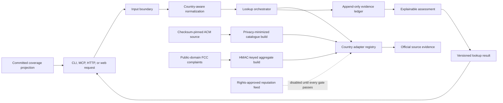

# Architecture

## Status and intent

CallerSignal v0.4.0 is a running read-only public lookup service backed by a validated production projection of the complete pinned Dutch ACM register, public-safe GB and US numbering fixtures, and a privacy-minimized five-year FCC unwanted-call complaint aggregate. The normalization core, evidence ledger, country adapters, lookup orchestrator, calibrated assessment, caller-campaign model, corpus transparency, and CLI, stdio MCP, hosted MCP, HTTP, and web surfaces are implemented. Tested service boundaries also exist for licensed reputation feeds, controlled first-party reports, replaceable storage, private watches, verified organisation declarations, and privacy-safe operations, but those mutation paths remain disabled until their rights, credentials, identity, consent, moderation, retention, correction, deletion, and provider gates pass. Every surface keeps one domain truth and fails closed when evidence is missing or unreliable.

## Context flow



The input boundary records raw input and an explicit origin region when the input is not international. Normalization emits canonical E.164 plus presentation formats without asserting assignment or identity. The orchestrator selects independent country adapters, records observations and gaps, and emits one schema-valid result. Surface adapters render that same result; they may not create a separate verdict path.

## Layer contracts

### 1. Surface adapters

CLI, MCP, HTTP, and web adapters own parsing, transport, authentication or rate-limit hooks, and presentation. They depend inward on the lookup service and the committed result schema. They must not query sources, compute reputation, or persist reports directly.

### 2. Phone-number interpretation

The normalization core accepts either an internationally prefixed value or a national value plus an explicit ISO region. It retains raw input, origin region, parse decisions, E.164, and national display. Ambiguous, short, invalid, and unsupported inputs return typed guidance rather than a guessed country.

### 3. Country evidence adapters

Each country adapter declares coverage, source authority, reuse basis, permitted fields, retrieval time, freshness policy, and portability limitations. Adapters return observations and typed gaps. Initial adapters target official evidence for NL, GB, and US; adding a country requires the shared conformance suite.

### 4. Evidence and assessment

Source observations are immutable, timestamped, attributable, and content-addressable. Derived assessments can be rebuilt without rewriting evidence. Number-plan facts, allocation evidence, identity claims, community reports, lookup demand, and computed assessments are separate domain records. No lookup counter can feed a reputation outcome.

### 5. Reports and operations

Public reporting is outside the read-only wedge. It can start only after privacy, moderation, retention, correction, deletion, objection, rate limiting, deduplication, brigading, incident, and source-takedown controls have executable proof. Operational metrics must avoid raw numbers, requester identities, and personal lookup trails.

## Storage and side-effect boundaries

The domain core remains deterministic: it receives normalized input and source observations, then emits a result. Network access belongs inside country adapters. Durable evidence writes belong behind the evidence-ledger interface. Report mutations belong behind the reporting service. Metrics, logs, caches, notifications, and rate limits are explicit ports rather than hidden domain side effects.

The read-only implementation uses replaceable interfaces, a generated immutable ACM SQLite catalogue, and deterministic public-safe fixtures. The generated database is built during deployment, validated before activation, and never committed. A thin Vercel adapter serves the owned production deployment, while a mutable database, queue, cache, analytics vendor, and all mutation infrastructure remain deferred decisions.

## Failure semantics

- A source timeout becomes an `unavailable` gap, not “no reports” or “safe.”
- Stale evidence remains visible with its retrieval time and freshness status.
- Conflicting observations stay separate and produce explicit uncertainty.
- Unsupported countries and ambiguous input fail with typed, actionable guidance.
- Allocation holder, original carrier, current provider, subscriber, and caller are never interchangeable.
- Every public assessment includes reasons, confidence, source handles, evidence gaps, and residual-risk wording.

## Trust boundaries and threats

Untrusted inputs include lookup values, region hints, public reports, external source payloads, and web requests. External sources can change format, license, availability, or semantics. Caller ID can be spoofed, phone numbers can be ported, and public reporting can be brigaded. The design therefore validates at every boundary, records source identity and time, separates evidence classes, rate-limits mutation, minimizes telemetry, and avoids identity or guilt claims.

Secrets and private data may exist only in ignored local configuration or an approved secret store. They must not appear in code, fixtures, logs, screenshots, test output, `.go` evidence, commits, issues, or releases.

## Extension points

- Country adapters implement the shared capability and conformance contract.
- Surface adapters consume the shared lookup-result schema.
- Evidence stores implement append-only observation semantics.
- Assessment policies consume typed evidence without mutating it.
- Report moderation and abuse controls remain independently testable.
- Official-source refreshes and authorized reputation feeds enter through manifest- and rights-gated adapters without changing the domain result.

## Repository and validation architecture

`.go` is the source of truth for objectives, dependency order, acceptance, verification, evidence, and task state. `docs/vision.json` is the tested design contract. `make check` is the authoritative repository-local gate and validates both without depending on a hosted CI runtime.

Decisions that change a public boundary, schema, source-reuse basis, storage model, moderation policy, or supported claim require an architecture decision record and corresponding updates to the vision contract and affected `.go` tasks.

## Conditional architecture governance

CallerSignal activates the Go workflow stack's conditional architecture lane for consequential work without retroactively turning ordinary or historical tasks into architecture ceremony. The accepted [`public-evidence-platform`](../.go/architecture/briefs/public-evidence-platform.json) brief governs the current read-only source-to-assessment pipeline, public contracts, cross-surface delivery, and deployment data boundary. Decision `public-evidence-boundary-v1` in `.go/decisions/events.jsonl` records why those components form one governed scope.

New tasks are classified before claim when they change a source, public schema, integration, trust boundary, privacy or security behavior, storage, migration, quality attribute, or deployment data path. Local reversible changes continue through the normal task critic. Material changes must reference an accepted brief and governing decision and must record conformance for every applicable scope. Foundational changes also stop for a named human decision or risk-acceptance gate; an automation identity cannot satisfy it.

The architecture brief makes five properties measurable: cross-surface semantic parity, rights-gated source activation, privacy-minimized public state, fail-closed uncertainty, and fresh-clone operability. Normal test and release evidence remains canonical in `.go/evidence/events.jsonl`; architecture events reference that proof rather than duplicating it. Deviations remain visible until repaired or covered by a reasoned, named-owner, time-bounded waiver.

Operator readback is executable:

```console
./go architecture validate . --json
./go architecture status . --json
./go architecture readback . --task-id <task-id> --json
```

After verified material work, record one conformance event per applicable scope with explicit principle, decision, and quality-attribute checks. This architecture state governs future consequential changes; it deliberately does not backfill briefs, reviews, or waivers for already completed tasks.
