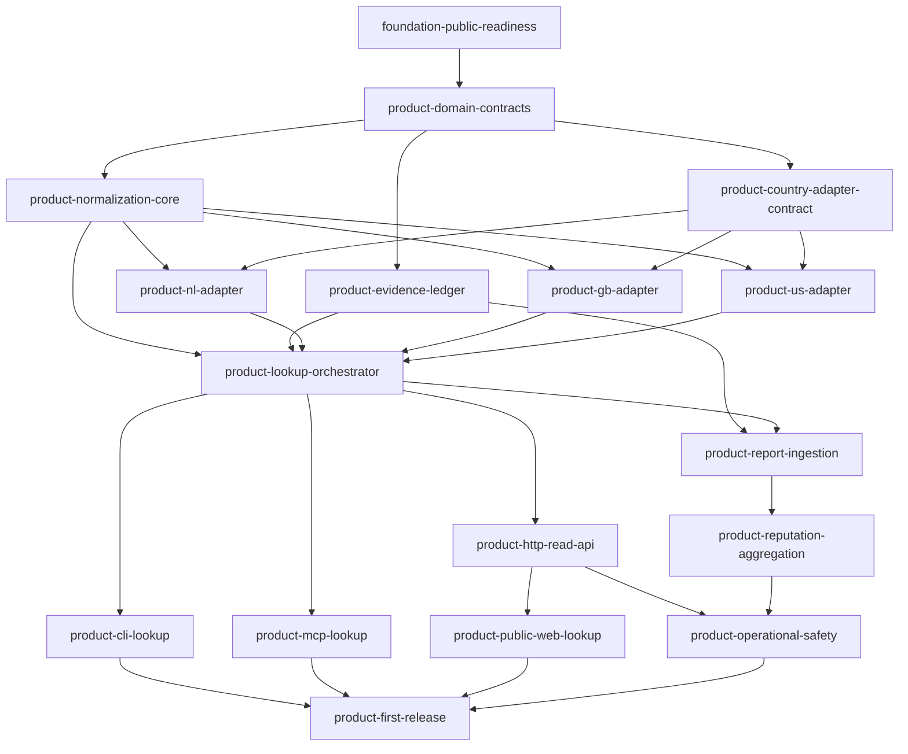

# Dependency-Ordered Implementation Plan

## Planning contract

The repository foundation shipped at v0.1.0. On the unreleased `main` branch, twelve of the sixteen product tasks below are implemented and approved: domain contracts, normalization, the evidence ledger, the adapter contract, all three initial country adapters, the lookup orchestrator, CLI, MCP, HTTP, and web. Four remain open: report ingestion, reputation aggregation, operational safety, and the first functional release. Their `.go` JSON files are authoritative; this document is the human-readable execution map. A task may start only when every listed dependency is approved as done.

Descriptions below define each task's contract; completion state comes only from its reviewed `.go` record.

## Phase 1 — Domain truth

### `product-domain-contracts`

Depends on `foundation-public-readiness`. Define versioned schemas for phone numbers, source evidence, lookup results, and call reports while keeping facts, demand, identity claims, observations, and assessments separate.

Acceptance: schemas preserve evidence classes; every assessment requires provenance, freshness, confidence, reason codes, and residual risk.

Verify: `uv run pytest tests/contracts -q`.

### `product-normalization-core`

Depends on `product-domain-contracts`. Implement country-aware parsing that requires an origin region for national input and emits E.164 plus presentation context.

Acceptance: explicit origin semantics; NL, GB, US, invalid, ambiguous, non-geographic, and short-number cases are tested.

Verify: `uv run pytest tests/unit/test_numbering.py -q` and `uv run ruff check src tests`.

### `product-evidence-ledger`

Depends on `product-domain-contracts`. Implement immutable, timestamped, source-attributed, content-addressable observations and rebuildable derived state.

Acceptance: original observations cannot be mutated; reprocessing does not rewrite source evidence.

Verify: `uv run pytest tests/unit/test_evidence_ledger.py -q`.

### `product-country-adapter-contract`

Depends on `product-domain-contracts`. Define adapter capabilities and a shared conformance suite.

Acceptance: every adapter declares coverage, authority, license, freshness, failure behavior, and portability limits; missing or stale data fails closed.

Verify: `uv run pytest tests/contract/test_country_adapters.py -q`.

## Phase 2 — Initial country evidence

The three adapters can proceed in parallel after the normalization core and adapter contract are approved.

### `product-nl-adapter`

Depends on `product-normalization-core` and `product-country-adapter-contract`. Implement permitted ACM numbering evidence while distinguishing range holder, current provider, subscriber, and caller.

Acceptance: covered ranges resolve from a pinned public-safe fixture with provenance and freshness; holder data is never subscriber identity or guaranteed current provider.

Verify: `uv run pytest tests/adapters/test_nl.py -q`.

### `product-gb-adapter`

Depends on `product-normalization-core` and `product-country-adapter-contract`. Implement permitted Ofcom numbering evidence.

Acceptance: covered ranges resolve from a pinned public-safe fixture; unknown, stale, and non-covered data remain explicitly unknown.

Verify: `uv run pytest tests/adapters/test_gb.py -q`.

### `product-us-adapter`

Depends on `product-normalization-core` and `product-country-adapter-contract`. Implement permitted NANPA and regulator evidence without treating plan validity as identity.

Acceptance: covered evidence has provenance and freshness; reserved fictional numbers remain distinct from assignable and assigned numbers.

Verify: `uv run pytest tests/adapters/test_us.py -q`.

## Phase 3 — Shared read-only lookup

### `product-lookup-orchestrator`

Depends on `product-normalization-core`, `product-evidence-ledger`, and all three initial adapters. Normalize input, select adapters, collect evidence, and emit one result.

Acceptance: each request records interpretation, sources checked, evidence, gaps, and reason codes; adapter failure creates a source-specific gap without fabricated claims.

Verify: `uv run pytest tests/integration/test_lookup.py -q`.

## Phase 4 — Interface parity

The first three interfaces can proceed in parallel after the orchestrator is approved. Each consumes the same lookup-result schema.

### `product-cli-lookup`

Depends on `product-lookup-orchestrator`. Add human and JSON lookup output with explicit `--region` behavior.

Acceptance: national and international inputs follow the shared interpretation contract; JSON validates against the canonical schema.

Verify: `uv run pytest tests/integration/test_cli.py -q`.

### `product-mcp-lookup`

Depends on `product-lookup-orchestrator`. Add the read-only `lookup_phone_number` MCP tool.

Acceptance: MCP input exposes origin-region semantics; structured content and CLI JSON remain field-for-field compatible.

Verify: `uv run pytest tests/integration/test_mcp.py -q`.

### `product-http-read-api`

Depends on `product-lookup-orchestrator`. Add a versioned, rate-limit-ready HTTP adapter.

Acceptance: responses validate against the canonical schema; telemetry can be minimized and cannot mutate reputation.

Verify: `uv run pytest tests/integration/test_http_api.py -q`.

### `product-public-web-lookup`

Depends on `product-http-read-api`. Build an accessible public renderer over the HTTP result without a browser-only truth path.

Acceptance: context, evidence, unknowns, confidence, and spoofing-safe wording lead the interface; accessibility, responsive, privacy, and no-result states are proven.

Verify: `uv run pytest tests/e2e -q` and `npm --prefix web test`.

## Phase 5 — Moderated evidence and operations

### `product-report-ingestion`

Depends on `product-evidence-ledger` and `product-lookup-orchestrator`. Accept explicit reports as unverified observations only after privacy and moderation controls exist.

Acceptance: reports describe calls displaying a number; retention, correction, deletion, rate limiting, deduplication, and brigading controls are enforced.

Verify: `uv run pytest tests/integration/test_reports.py -q`.

### `product-reputation-aggregation`

Depends on `product-report-ingestion`. Compute explainable signals from independent, recent, moderated evidence.

Acceptance: labels expose confidence, reasons, evidence diversity, freshness, and uncertainty; lookup volume and one unverified report cannot create a fraud verdict.

Verify: `uv run pytest tests/unit/test_assessment.py -q`.

### `product-operational-safety`

Depends on `product-http-read-api`, `product-report-ingestion`, and `product-reputation-aggregation`. Add privacy-preserving observability, abuse controls, and operational runbooks.

Acceptance: health metrics avoid raw-number and personal request trails; incident, deletion, correction, takedown, and abuse runbooks are executable.

Verify: `uv run pytest tests/operations -q`.

## Phase 6 — First functional release

### `product-first-release`

Depends on `product-cli-lookup`, `product-mcp-lookup`, `product-public-web-lookup`, and `product-operational-safety`. Publish only after the complete read-only wedge and operational boundaries are proven.

Acceptance: NL, GB, and US pass contracts, integration, privacy, adapter, and cross-surface parity gates; release notes state support, unsupported claims, known gaps, and upgrades.

Verify: `make check` and strict public `repo-complete` validation.

## Dependency overview

Use `./go next .` rather than selecting from the diagram by eye; the repo-local workflow is the source of task state and eligibility.
