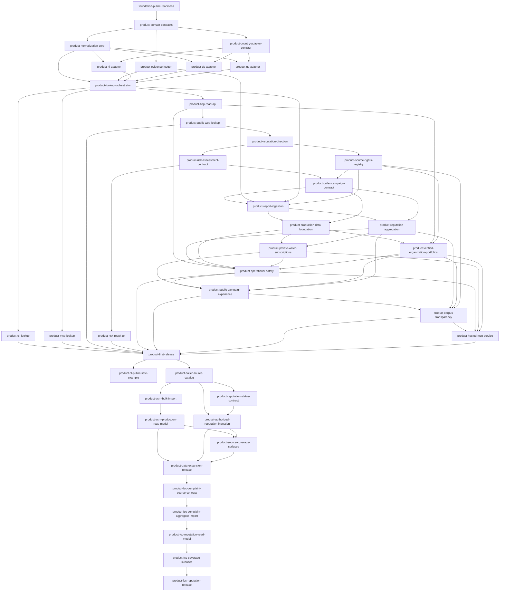

# Dependency-Ordered Implementation Plan

## Planning contract

The repository foundation shipped at v0.1.0. CallerSignal v0.2.0 completed twenty-seven dependency-ordered product tasks: shared lookup and risk contracts, NL/GB/US adapters, CLI, stdio and hosted MCP, HTTP, web, caller campaigns, controlled report and storage foundations, private watches, verified organisation declarations, operational safety, public transparency, and release proof. CallerSignal v0.3.0 added one public-safe Dutch example and seven rights-aware data-expansion tasks. CallerSignal v0.4.0 completes the five-task public-domain FCC complaint-signal slice: source contract, privacy-preserving full aggregate import, conservative lookup evidence, cross-surface coverage, and production release proof. The reviewed `.go` JSON files are authoritative; this document remains the human-readable dependency and verification map for maintenance and extension work.

Descriptions below define each task's contract; completion state comes only from its reviewed `.go` record.

## Phase 1 — Domain truth

### `product-domain-contracts`

Depends on `foundation-public-readiness`. Define versioned schemas for phone numbers, source evidence, lookup results, and call reports while keeping facts, demand, identity claims, observations, and assessments separate.

Acceptance: schemas preserve evidence classes; every assessment requires provenance, freshness, confidence, reason codes, and residual risk.

Verify: `uv run pytest tests/contracts -q`.

### `product-normalization-core`

Depends on `product-domain-contracts`. Implement country-aware parsing that requires an origin region for national input and emits E.164 plus presentation context.

Acceptance: explicit origin semantics; NL, GB, US, invalid, ambiguous, non-geographic, and short-number cases are tested.

Verify: `uv run pytest tests/unit/test_numbering.py -q` and `uv run ruff check src tests`.

### `product-evidence-ledger`

Depends on `product-domain-contracts`. Implement immutable, timestamped, source-attributed, content-addressable observations and rebuildable derived state.

Acceptance: original observations cannot be mutated; reprocessing does not rewrite source evidence.

Verify: `uv run pytest tests/unit/test_evidence_ledger.py -q`.

### `product-country-adapter-contract`

Depends on `product-domain-contracts`. Define adapter capabilities and a shared conformance suite.

Acceptance: every adapter declares coverage, authority, license, freshness, failure behavior, and portability limits; missing or stale data fails closed.

Verify: `uv run pytest tests/contract/test_country_adapters.py -q`.

## Phase 2 — Initial country evidence

The three adapters can proceed in parallel after the normalization core and adapter contract are approved.

### `product-nl-adapter`

Depends on `product-normalization-core` and `product-country-adapter-contract`. Implement permitted ACM numbering evidence while distinguishing range holder, current provider, subscriber, and caller.

Acceptance: covered ranges resolve from a pinned public-safe fixture with provenance and freshness; holder data is never subscriber identity or guaranteed current provider.

Verify: `uv run pytest tests/adapters/test_nl.py -q`.

### `product-gb-adapter`

Depends on `product-normalization-core` and `product-country-adapter-contract`. Implement permitted Ofcom numbering evidence.

Acceptance: covered ranges resolve from a pinned public-safe fixture; unknown, stale, and non-covered data remain explicitly unknown.

Verify: `uv run pytest tests/adapters/test_gb.py -q`.

### `product-us-adapter`

Depends on `product-normalization-core` and `product-country-adapter-contract`. Implement permitted NANPA and regulator evidence without treating plan validity as identity.

Acceptance: covered evidence has provenance and freshness; reserved fictional numbers remain distinct from assignable and assigned numbers.

Verify: `uv run pytest tests/adapters/test_us.py -q`.

## Phase 3 — Shared read-only lookup

### `product-lookup-orchestrator`

Depends on `product-normalization-core`, `product-evidence-ledger`, and all three initial adapters. Normalize input, select adapters, collect evidence, and emit one result.

Acceptance: each request records interpretation, sources checked, evidence, gaps, and reason codes; adapter failure creates a source-specific gap without fabricated claims.

Verify: `uv run pytest tests/integration/test_lookup.py -q`.

## Phase 4 — Interface parity

The first three interfaces can proceed in parallel after the orchestrator is approved. Each consumes the same lookup-result schema.

### `product-cli-lookup`

Depends on `product-lookup-orchestrator`. Add human and JSON lookup output with explicit `--region` behavior.

Acceptance: national and international inputs follow the shared interpretation contract; JSON validates against the canonical schema.

Verify: `uv run pytest tests/integration/test_cli.py -q`.

### `product-mcp-lookup`

Depends on `product-lookup-orchestrator`. Add the read-only `lookup_phone_number` MCP tool.

Acceptance: MCP input exposes origin-region semantics; structured content and CLI JSON remain field-for-field compatible.

Verify: `uv run pytest tests/integration/test_mcp.py -q`.

### `product-http-read-api`

Depends on `product-lookup-orchestrator`. Add a versioned, rate-limit-ready HTTP adapter.

Acceptance: responses validate against the canonical schema; telemetry can be minimized and cannot mutate reputation.

Verify: `uv run pytest tests/integration/test_http_api.py -q`.

### `product-public-web-lookup`

Depends on `product-http-read-api`. Build an accessible public renderer over the HTTP result without a browser-only truth path.

Acceptance: context, evidence, unknowns, confidence, and spoofing-safe wording lead the interface; accessibility, responsive, privacy, and no-result states are proven.

Verify: `uv run pytest tests/e2e -q` and `npm --prefix web test`.

## Phase 5 — Calibrated risk and source eligibility

### `product-reputation-direction`

Adopt the hybrid reputation vision and safety gates before changing the shared product contract or accepting reputation inputs.

Acceptance: the four risk states and eligible-source boundary are durable in repo-local and public vision contracts; the agent spec defines cross-surface behavior, evaluations, fail-closed handling, deployment, and metadata-only observability; downstream work is dependency ordered.

Verify: `uv run pytest tests/test_repository_contract.py -q` and `./go validate .`.

### `product-risk-assessment-contract`

Depends on `product-reputation-direction`. Define `official_warning`, `elevated_signals`, `no_risk_evidence`, and `insufficient_evidence` in the canonical result and derive them through one explainable policy.

Acceptance: every lookup exposes one state, stable reasons, and an action; numbering evidence alone remains `insufficient_evidence`; `no_risk_evidence` requires a current eligible risk-capable source; failed, stale, contradictory, unsupported, or rights-restricted risk evidence fails closed; lookup popularity and one unverified report are invariant negatives.

Verify: `uv run pytest tests/unit/test_assessment.py tests/integration/test_lookup.py tests/integration/test_cli.py tests/integration/test_mcp.py tests/integration/test_http_api.py -q`.

### `product-risk-result-ux`

Depends on `product-risk-assessment-contract`. Render the shared state as a dominant text-and-icon result banner inspired by the clarity of Have I Been Pwned without adopting a binary safe-number promise.

Acceptance: all four states remain distinguishable without color alone; source confidence is subordinate and cannot read as a safety percentage; desktop and mobile visual proof plus the live Vercel alias pass.

Verify: `npm --prefix web test`, `uv run pytest tests/e2e/test_web.py -q`, and `make check`.

### `product-source-rights-registry`

Depends on `product-reputation-direction`. Add a machine-validated registry that records authority, reuse basis, permitted fields, freshness, outage behavior, privacy status, and takedown ownership before a source can be enabled.

Acceptance: enabled official sources have complete rights metadata; unlicensed caller-report sites are disabled permission-required candidates with zero permitted fields; robots behavior, reuse permission, database/copyright review, privacy review, and provenance remain separate gates.

Verify: `uv run pytest tests/contracts/test_source_registry.py -q` and `make check`.

### `product-caller-campaign-contract`

Depends on `product-risk-assessment-contract` and `product-source-rights-registry`. Define the versioned, spoofing-aware caller-campaign object and adopt it in the durable product vision.

Acceptance: status, categories, jurisdictions, seen dates, eligible evidence, confidence, freshness, actions, and corrections are deterministic; membership refers only to displayed-number observations and never proves identity.

Verify: `uv run pytest tests/contracts/test_caller_campaign.py -q` and `make check`.

## Phase 6 — Moderated evidence and durable data

### `product-report-ingestion`

Depends on `product-caller-campaign-contract`, `product-evidence-ledger`, `product-lookup-orchestrator`, and `product-source-rights-registry`. Accept explicit reports as unverified observations only after legal, privacy, moderation, and source-eligibility controls exist.

Acceptance: reports describe calls displaying a number; retention, correction, deletion, rate limiting, deduplication, and brigading controls are enforced.

Verify: `uv run pytest tests/integration/test_reports.py -q`.

### `product-reputation-aggregation`

Depends on `product-caller-campaign-contract` and `product-report-ingestion`. Compute explainable signals and freshness-bounded campaign records from independent, recent, moderated evidence.

Acceptance: labels expose confidence, reasons, evidence diversity, freshness, and uncertainty; lookup volume and one unverified report cannot create a fraud verdict.

Verify: `uv run pytest tests/unit/test_assessment.py tests/unit/test_campaigns.py -q`.

### `product-production-data-foundation`

Depends on `product-caller-campaign-contract` and `product-report-ingestion`. Add replaceable storage ports for reports, campaigns, watches, verification challenges, outbox messages, corrections, and deletions.

Acceptance: local proof covers atomic operations, retention, deduplication, deletion receipts, and outbox semantics without retaining requester IP addresses or raw lookup histories; production provider adoption remains an explicit reviewed gate.

Verify: `uv run pytest tests/storage -q` and `make check`.

### `product-private-watch-subscriptions`

Depends on `product-production-data-foundation` and `product-reputation-aggregation`. Implement private, verified, revocable watch subscriptions with idempotent notifications for material state changes.

Acceptance: ownership, consent, minimization, anti-enumeration, delivery failure, expiry, correction, deletion, and unsubscribe behavior fail closed.

Verify: `uv run pytest tests/integration/test_watch.py -q` and `make check`.

### `product-verified-organization-portfolios`

Depends on `product-http-read-api`, `product-production-data-foundation`, and `product-source-rights-registry`. Let organisations declare bounded official-number portfolios only after a challenge workflow.

Acceptance: verification proves the declaration, never call origin; challenge expiry, replay, conflict, audit, correction, deletion, and appeal paths are tested.

Verify: `uv run pytest tests/integration/test_organizations.py -q` and `make check`.

### `product-operational-safety`

Depends on the HTTP API, reporting, aggregation, durable data, watch, and organisation workflows. Add privacy-preserving observability, abuse controls, and operational runbooks.

Acceptance: health metrics avoid raw-number and personal request trails; incident, deletion, correction, takedown, and abuse runbooks are executable.

Verify: `uv run pytest tests/operations -q`.

## Phase 7 — Public campaign product and agent surface

### `product-public-campaign-experience`

Depends on aggregation, private watch, verified portfolios, and operational safety. Turn the lookup result into an action-oriented campaign experience and add a safe public campaign catalogue and detail view.

Acceptance: the displayed number, calibrated state, recency, checklist, campaign history, report/watch actions, corrections, and source coverage are clear across desktop and mobile without exposing private reports or lookup popularity.

Verify: `npm --prefix web test`, `uv run pytest tests/e2e/test_web.py -q`, and `make check`.

### `product-corpus-transparency`

Depends on the public campaign experience, aggregation, source-rights registry, and verified portfolios. Publish honest, privacy-thresholded corpus and coverage metrics.

Acceptance: metrics derive only from enabled sources and eligible aggregate records; jurisdictions, freshness, ingest gaps, moderation thresholds, corrections, methodology version, and the meaning of no matching evidence are explicit.

Verify: `uv run pytest tests/integration/test_transparency.py -q` and `make check`.

### `product-hosted-mcp-service`

Depends on transparency, operations, private watch, and verified portfolios. Publish a hosted remote MCP endpoint over the canonical contracts.

Acceptance: discovery and public read-only tools work anonymously; protected mutation tools require precise OAuth scopes and preserve verification, consent, rate, privacy, and deletion controls; local protocol tests and live production proof pass.

Verify: `uv run pytest tests/integration/test_remote_mcp.py -q`, `make check`, and production protocol probes.

## Phase 8 — First functional release

### `product-first-release`

Depends on the existing CLI/MCP/web wedge, calibrated risk presentation, campaign experience, corpus transparency, hosted MCP, and operational safety. Publish only after those public and private boundaries are proven.

Acceptance: NL, GB, and US lookups plus campaign intelligence, private watch, verified organisation context, transparency, and hosted MCP pass contracts, integration, privacy, and cross-surface parity gates; release notes state support, unsupported claims, provider boundaries, known gaps, and upgrades.

Verify: `make check` and strict public `repo-complete` validation.

## Phase 9 — Post-release product refinements

### `product-nl-public-safe-example`

Depends on `product-first-release`. Add the pinned public ACM blocked-number record `0906-8844` as the Dutch website example, using origin region `NL` and the canonical lookup route.

Acceptance: the native accessible example control is visible with the existing US and GB examples on desktop and 375px mobile; it makes no unsupported subscriber, caller-identity, harmfulness, or general safety claim; browser proof has no clipping, overflow, console errors, or temporary copy.

Verify: `uv run pytest tests/e2e/test_web.py -q`, `npm --prefix web test`, and `make check`.

## Phase 10 — Rights-aware data expansion

### `product-caller-source-catalog`

Depends on `product-first-release`. Publish a dated machine-readable discovery index of Dutch and international caller-report services, their capabilities, automation controls, reuse posture, commercial integration routes, and activation gaps without copying their number records.

Acceptance: every service found by the documented discovery queries has terms and robots references, a rights decision, and a next action; public visibility and robots controls never grant ingestion rights; no report text or phone-number records enter the repository.

Verify: `uv run pytest tests/contracts/test_caller_report_service_index.py tests/contracts/test_source_registry.py -q` and `make check`.

### `product-acm-bulk-import`

Depends on `product-caller-source-catalog`. Build a reproducible importer for the complete checksum-pinned official ACM CSV download and project it into a holder-free SQLite range catalogue.

Acceptance: archive, checksum, schema, rows, ranges, and duplicate identifiers fail closed; provenance, freshness, digests, status counts, and destination counts are retained; generated downloads and databases remain outside Git.

Verify: `uv run pytest tests/unit/test_acm_catalog.py -q`, `make build-acm-catalog`, and `make check`.

### `product-acm-release-pin-refresh`

Depends on `product-acm-bulk-import`. Refresh the immutable ACM archive pin when the official ZIP digest changes, but only after the archive member, CSV schema, byte sizes, row and range validation, status counts, destination count, newest mutation, and privacy-minimized build all match reviewed expectations.

Acceptance: the official HTTPS artifact has an exact reviewed digest and retrieval time; the generated range catalogue contains no holder or subscriber projection; the transparency snapshot is reproducible; checksum drift still fails closed; focused, repository, and production-build gates pass.

Verify: `uv run pytest tests/unit/test_acm_catalog.py tests/integration/test_transparency.py -q`, `make check`, and `npm run build:vercel`.

### `product-reputation-status-contract`

Depends on `product-caller-source-catalog`. Define source-neutral aggregate spam, phishing, scam, telemarketing, robocall, nuisance, and current-no-match observations under the existing calibrated four-state assessment contract.

Acceptance: every admitted status retains its native value, basis, freshness, confidence, and provenance; `safe` is never a stored verdict; unsupported, stale, conflicting, or unverified evidence fails closed.

Verify: `uv run pytest tests/contracts/test_domain_contracts.py tests/unit/test_assessment.py tests/integration/test_lookup.py -q` and `make check`.

### `product-acm-production-read-model`

Depends on `product-acm-bulk-import`. Use the generated ACM catalogue in canonical NL lookups and build it during Vercel production deployment while retaining the public-safe fixture fallback.

Acceptance: matching uses canonical E.164 intervals and emits only number type and regulatory status with record provenance; missing, stale, invalid, or unavailable catalogues fail closed; no holder, subscriber, provider, caller, or safety claim is inferred.

Verify: `npm run build:acm`, `uv run pytest tests/adapters/test_nl.py tests/integration/test_lookup.py tests/e2e/test_web.py -q`, and `make check`.

### `product-authorized-reputation-ingestion`

Depends on `product-caller-source-catalog` and `product-reputation-status-contract`. Add bounded, rate-limited ingestion adapters that remain inert unless a source registry entry proves compatible extraction and republication rights, approved fields, credentials, privacy, takedown, and provenance.

Acceptance: authorized feeds admit only permitted aggregate status fields; disabled sources perform zero report-page requests; narratives, names, lookup popularity, requester data, and source-native safety claims cannot enter processing.

Verify: `uv run pytest tests/integration/test_reputation_ingest.py tests/contracts/test_source_registry.py -q` (authorization, zero-request, normalization, rate, schedule, outage, drift, and stale proofs) and `make check`.

### `product-nl-tellows-source-design`

Depends on `product-authorized-reputation-ingestion`. Select and validate the first additional Dutch licensed-risk candidate without granting runtime authority. Record current primary-source evidence, provider fit, a minimized field and semantic boundary, every contractual and operational activation gate, and an explicit zero-request state.

Acceptance: the tellows Live API route is selected for contract review because it advertises Dutch and country-filtered caller-protection integration; Hiya is explicitly deferred as an own/registered-business-number product fit; only opaque record ID, score, allowlisted category, and observation time are proposed; names, comments, location, lookup demand, bulk inventories, raw payloads, and positive safety claims remain prohibited; no provider registry entry, adapter, credential, or network request is activated.

Verify: `uv run pytest tests/contracts/test_source_acquisition.py tests/contracts/test_caller_report_service_index.py tests/contracts/test_source_registry.py tests/integration/test_reputation_ingest.py -q` and `make check`.

### `product-source-coverage-surfaces`

Depends on `product-acm-production-read-model` and `product-authorized-reputation-ingestion`. Expose one privacy-safe source-coverage projection through HTTP, CLI, stdio MCP, hosted MCP, transparency data, and the public website.

Acceptance: coverage reports ACM counts, categories, digest and freshness plus indexed, licensable, enabled, and unavailable reputation-source counts; it reveals no raw inventory or private data and never presents source count as trust; desktop and mobile browser proof pass.

Verify: `uv run pytest tests/integration tests/e2e/test_web.py -q`, `npm --prefix web test`, `make check`, and desktop/mobile browser proof of the available official versus unavailable reputation ledger.

### `product-data-expansion-release`

Depends on `product-acm-production-read-model`, `product-authorized-reputation-ingestion`, and `product-source-coverage-surfaces`. Release the complete rights-aware data-expansion slice after local, public-safety, repository, live browser, and protocol gates pass.

Release: `v0.3.0` packages this slice without activating an unlicensed reputation source.

Acceptance: the current official ACM catalogue is proven live with honest coverage; each ingested reputation source has compatible rights and operational privacy controls; no permission-required site is scraped; all canonical surfaces and repository-history safety checks pass.

Verify: `make check` and strict public `repo-complete` validation.

## Phase 11 — Public-domain complaint signal

### `product-fcc-complaint-source-contract`

Define a machine-validated source contract for the FCC Consumer Complaints Data — Unwanted Calls dataset before any row is processed.

Acceptance: the registry, manifest, and service index prove the source, public-domain reuse basis, anonymous API route, permitted input fields, freshness rule, correction owner, and fail-closed behavior; consumer complaints remain explicitly unverified and never become official warnings, verified identity, harmfulness, or safety claims.

Verify: `uv run pytest tests/contracts -q` and `make check`.

### `product-fcc-complaint-aggregate-import`

Depends on `product-fcc-complaint-source-contract`. Fetch a bounded rolling window through the manifest-declared Socrata API and build an immutable HMAC-keyed aggregate catalogue.

Acceptance: metadata, licence, schema, date bounds, pagination, normalization, and replacement are validated; the projection contains no plaintext number inventory, raw complaint row, reporter data, narrative, or source response; only bounded category counts, dates, provenance, digest, and coverage totals remain.

Verify: `uv run pytest tests/unit/test_fcc_catalog.py -q` and `make check`.

### `product-fcc-reputation-read-model`

Depends on `product-fcc-complaint-aggregate-import`. Add current FCC complaint observations to canonical US lookups through the privacy-preserving aggregate catalogue.

Acceptance: evidence uses only neutral nuisance or robocall categories with count basis, freshness, provenance, and spoofing limitations; one source cannot produce `elevated_signals` or `official_warning`; missing, stale, invalid, conflicting, and no-match states fail closed and never mean safe.

Verify: `uv run pytest tests/integration/test_lookup.py tests/adapters/test_us.py -q` and `make check`.

### `product-fcc-coverage-surfaces`

Depends on `product-fcc-reputation-read-model`. Expose exact aggregate coverage and limitations through HTTP, CLI, stdio MCP, hosted MCP, transparency data, and the public website.

Acceptance: every surface agrees on source freshness, rolling window, unique-number count, observation count, category counts, and limitations; desktop and mobile proof distinguish official numbering context from one enabled unverified complaint source without presenting volume as trust or safety.

Verify: `uv run pytest tests/integration tests/e2e/test_web.py -q`, `npm --prefix web test`, and `make check`.

### `product-fcc-reputation-release`

Depends on `product-fcc-coverage-surfaces`. Release the bounded FCC complaint-signal slice only after local, privacy, repository, production, browser, and protocol gates pass.

Acceptance: the current manifest-declared public-domain aggregate is proven live; the repository and history contain no raw source-number inventory, complaint rows, generated reputation database, lookup key, credential, or Vercel state; public copy preserves the unverified, single-source, spoofing, and absence-is-not-safety boundaries.

Verify: `make check` and strict public `repo-complete` validation.

## Dependency overview

Use `./go next .` rather than selecting from the diagram by eye; the repo-local workflow is the source of task state and eligibility.
